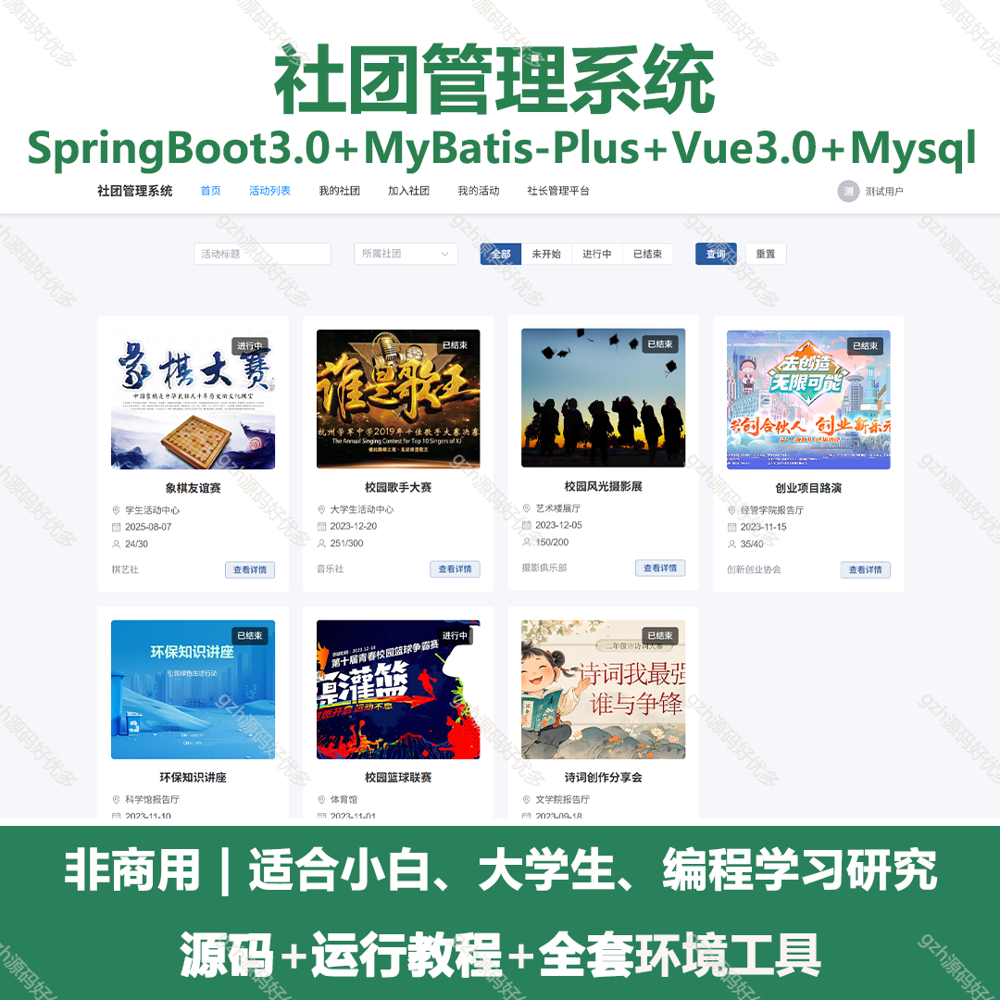
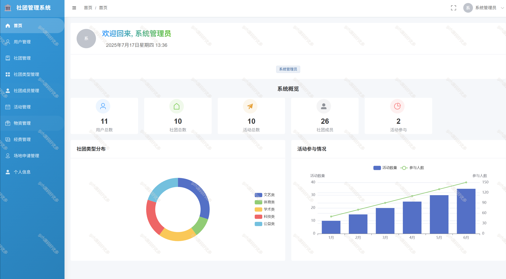
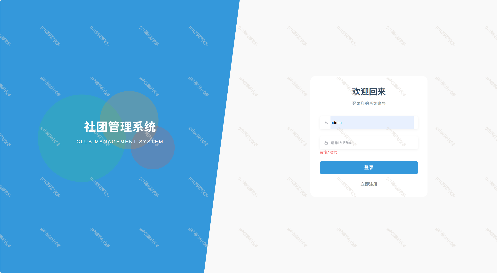
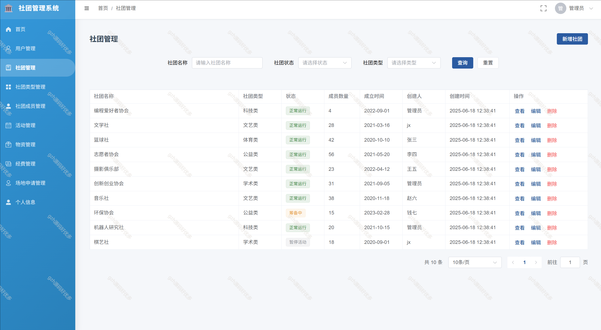
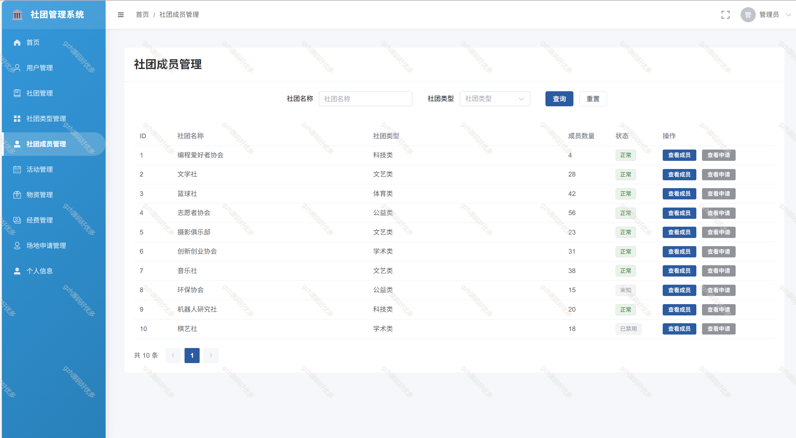
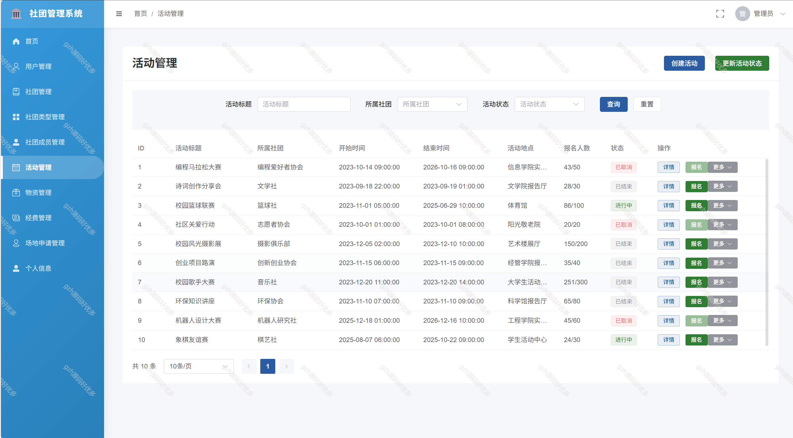
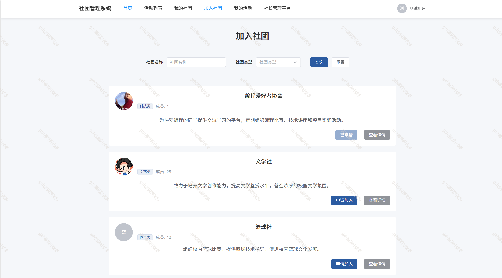
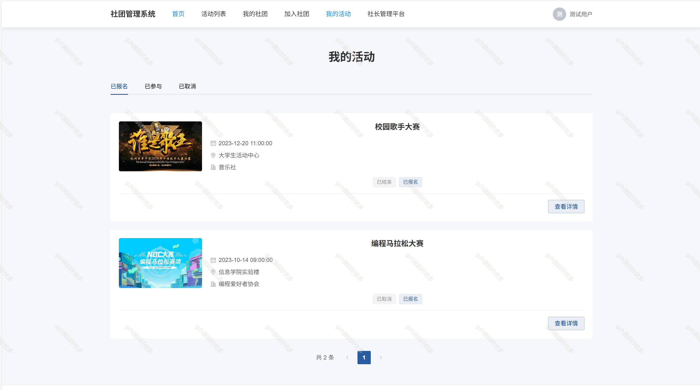
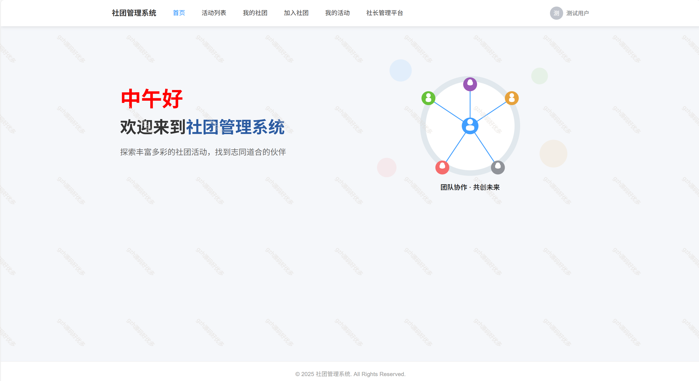

# springbootA529
springbootA529社团管理系统
 
## 查看主页获取源码

### 一、关键词
社团管理，社团管理系统

### 二、作品包含
源码+数据库+全套环境和工具资源+本地部署教程

### 三、项目技术
前端技术：Vue3.0、Element Plus + Axios、Vue Router，Pinia，vite
后端技术：Java、SpringBoot3.0、MyBatis-Plus

### 四、运行环境（以下版本亲测，其他版本兼容性请自行测试）
开发工具：IDEA/eclipse  + VSCODE

数据库：MySQL8.0

数据库管理工具：Navicat10以上版本

环境配置软件： JDK17 + Maven3.6.3

前端Nodejs：16

浏览器：谷歌浏览器

### 五、项目介绍
项目编号：springbootA529

社团管理系统是一个基于SpringBoot3+Vue3的前后端分离应用，旨在为高校社团提供全面的管理解决方案，包括社团信息管理、活动管理、成员管理、公告管理等功能

功能模块设计
3.1 用户认证模块
用户登录/注册/找回密码
角色分配（管理员、普通成员）
JWT认证授权
2.2 社团管理模块
社团基本信息管理（创建、查询、修改、删除）
社团类型管理
社团状态管理（筹备中、正常运行、已解散等）
社团风采展示（图片、简介等）
3.3 成员管理模块
成员加入申请处理
成员信息管理
成员角色分配（社长、副社长、干部、普通成员等）

3.4 活动管理模块
活动发布
活动审批
活动报名管理

3.6 资源管理模块
社团资金管理
物资管理
场地申请与管理
3.7 数据统计模块
社团活跃度分析
成员参与度统计
活动效果评估
数据可视化展示

### 六、运行截图

